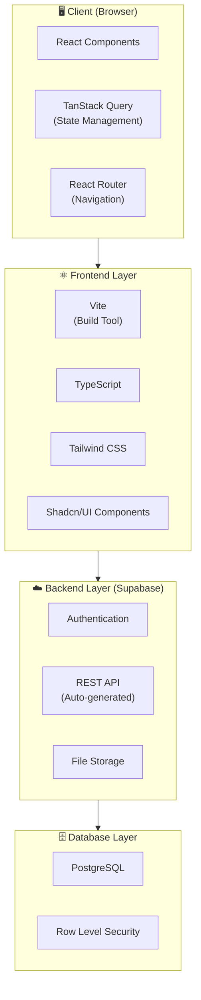
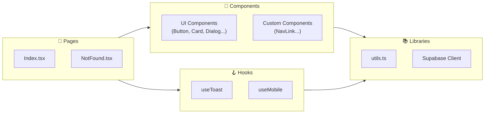
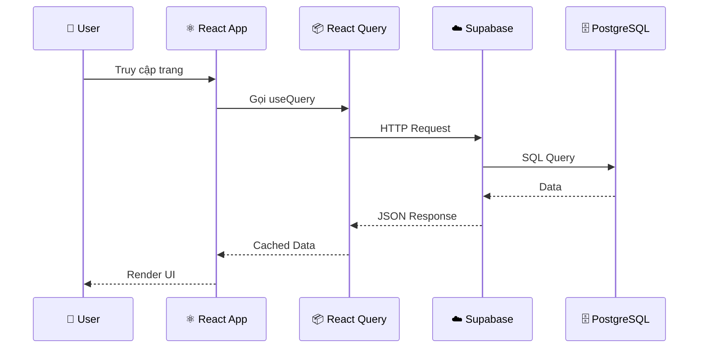
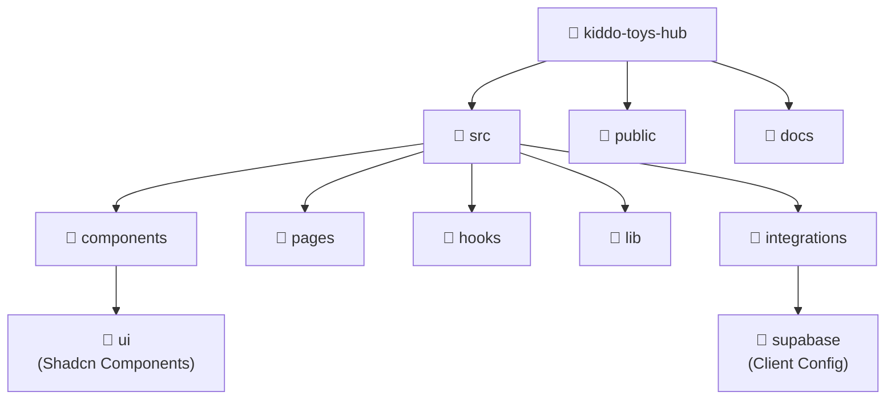
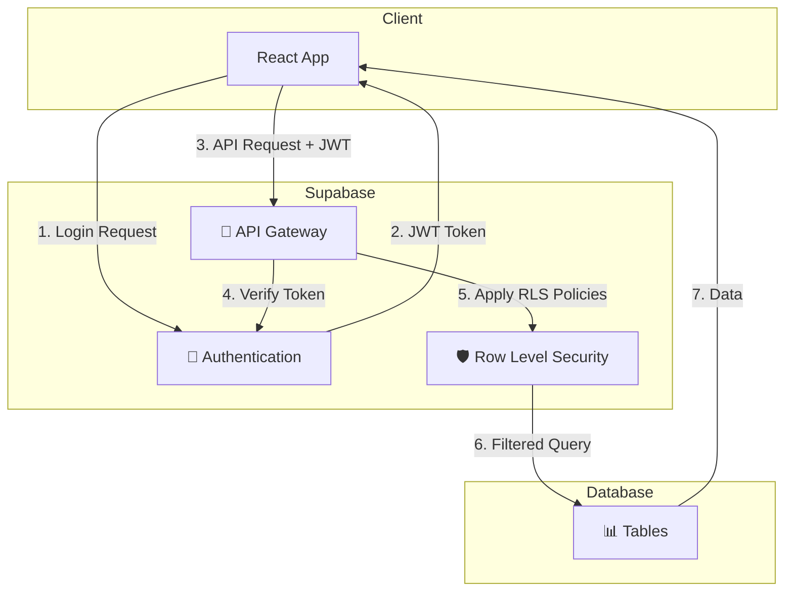
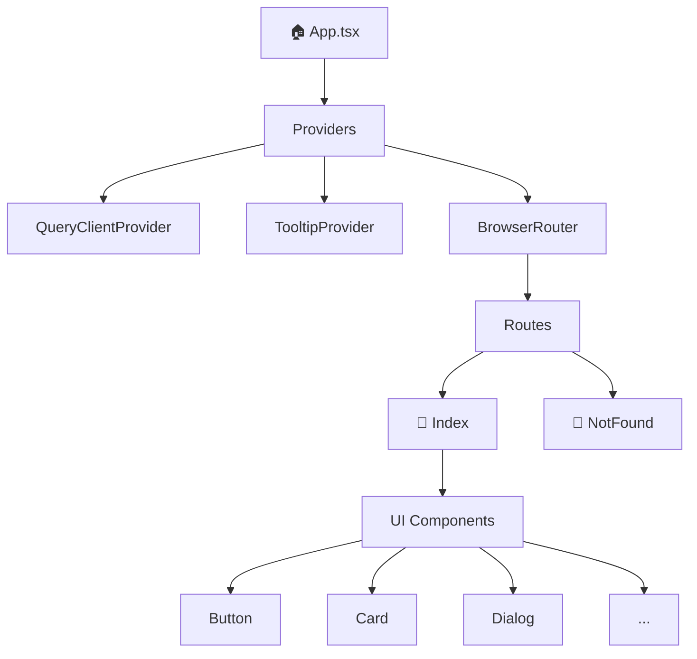
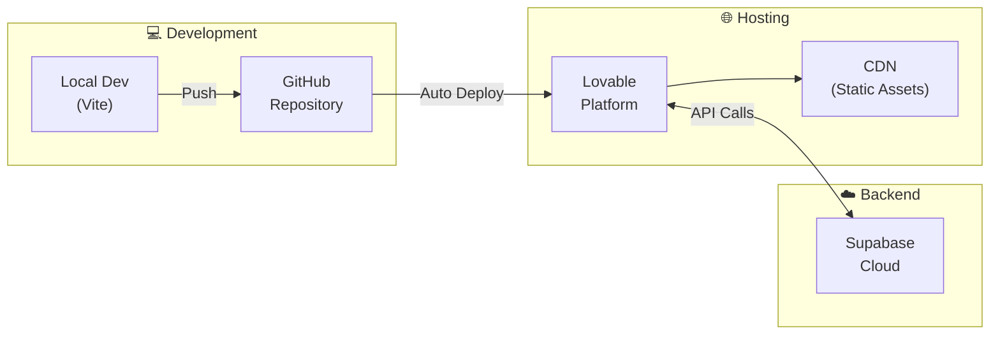
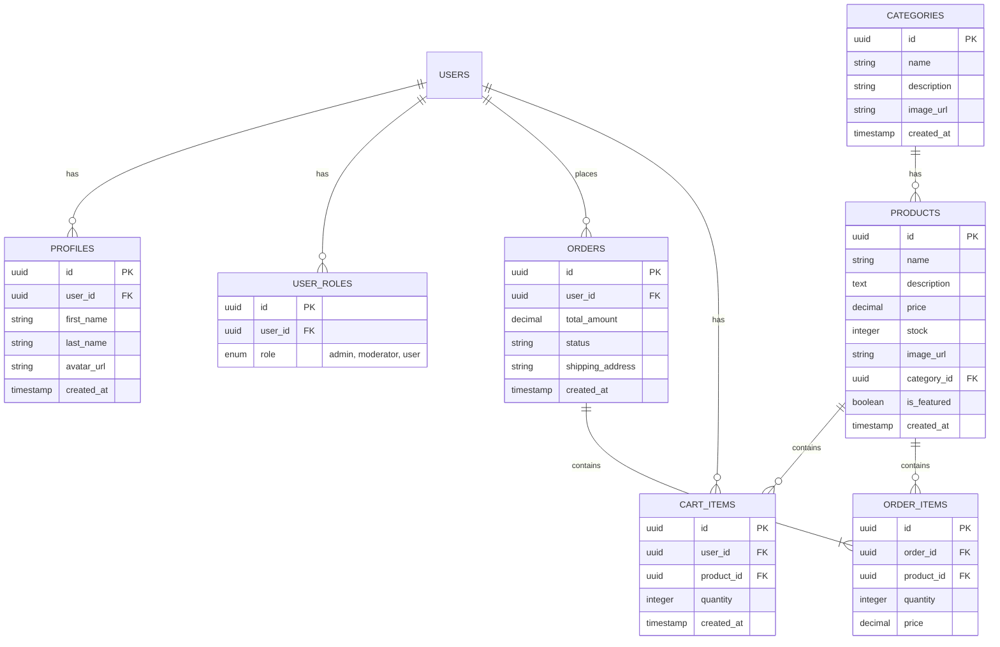

# 📘 Báo Cáo Kiến Trúc Hệ Thống - Kiddo Toys Hub

## 1. Tổng Quan Dự Án

**Kiddo Toys Hub** là một ứng dụng web thương mại điện tử chuyên bán đồ chơi trẻ em, được xây dựng với kiến trúc modern fullstack.

---

## 2. Kiến Trúc Tổng Quan Hệ Thống

---

## 3. Kiến Trúc Frontend Chi Tiết

---

## 4. Luồng Dữ Liệu (Data Flow)

---

## 5. Cấu Trúc Thư Mục

---

## 6. Stack Công Nghệ

### 6.1. Frontend

| Công nghệ | Phiên bản | Mô tả |
|-----------|-----------|-------|
| React | 18.3.1 | Thư viện xây dựng UI |
| TypeScript | 5.8.3 | Ngôn ngữ lập trình có kiểu |
| Vite | 5.4.19 | Build tool & dev server |
| React Router DOM | 6.30.1 | Quản lý routing |
| TanStack React Query | 5.83.0 | Server state management |

### 6.2. UI/Styling

| Công nghệ | Phiên bản | Mô tả |
|-----------|-----------|-------|
| Tailwind CSS | 3.4.17 | Utility-first CSS framework |
| Shadcn/UI | - | Component library |
| Radix UI | Various | Headless UI primitives |
| Lucide React | 0.462.0 | Icon library |

### 6.3. Backend

| Công nghệ | Mô tả |
|-----------|-------|
| Supabase | Backend-as-a-Service |
| PostgreSQL | Relational database |
| Row Level Security | Bảo mật cấp hàng dữ liệu |

### 6.4. Thư viện Hỗ trợ

| Công nghệ | Phiên bản | Mô tả |
|-----------|-----------|-------|
| React Hook Form | 7.61.1 | Form management |
| Zod | 3.25.76 | Schema validation |
| date-fns | 3.6.0 | Date utilities |
| Sonner | 1.7.4 | Toast notifications |

---

## 7. Sơ Đồ Bảo Mật (Security Flow)

---

## 8. Component Architecture

---

## 9. Deployment Architecture

---

## 10. Sơ Đồ ERD (Entity Relationship Diagram)

### Mô tả các bảng:

| Bảng | Mô tả |
|------|-------|
| **users** | Bảng hệ thống của Supabase Auth, chứa thông tin đăng nhập |
| **profiles** | Thông tin chi tiết người dùng (tên, avatar) |
| **user_roles** | Phân quyền người dùng (admin, moderator, user) |
| **categories** | Danh mục sản phẩm đồ chơi |
| **products** | Sản phẩm đồ chơi (tên, giá, mô tả, hình ảnh) |
| **cart_items** | Giỏ hàng của người dùng |
| **orders** | Đơn hàng đã đặt |
| **order_items** | Chi tiết các sản phẩm trong đơn hàng |

### Các mối quan hệ:

- **1-N**: Một user có nhiều profiles, roles, orders, cart_items
- **1-N**: Một category có nhiều products
- **1-N**: Một order có nhiều order_items
- **N-1**: Mỗi product thuộc một category

---

## 11. Sơ Đồ Use Case

```mermaid
flowchart TB
    subgraph Actors["👥 Actors"]
        Guest["🧑 Khách (Guest)"]
        User["👤 Người dùng (User)"]
        Admin["👨‍💼 Quản trị viên (Admin)"]
    end
    
    subgraph GuestUC["Use Cases - Khách"]
        UC1["Xem danh sách sản phẩm"]
        UC2["Xem chi tiết sản phẩm"]
        UC3["Tìm kiếm sản phẩm"]
        UC4["Lọc theo danh mục"]
        UC5["Đăng ký tài khoản"]
        UC6["Đăng nhập"]
    end
    
    subgraph UserUC["Use Cases - Người dùng"]
        UC7["Thêm vào giỏ hàng"]
        UC8["Xem giỏ hàng"]
        UC9["Cập nhật số lượng"]
        UC10["Xóa khỏi giỏ hàng"]
        UC11["Đặt hàng"]
        UC12["Xem lịch sử đơn hàng"]
        UC13["Cập nhật thông tin cá nhân"]
        UC14["Đăng xuất"]
    end
    
    subgraph AdminUC["Use Cases - Quản trị viên"]
        UC15["Quản lý sản phẩm"]
        UC16["Quản lý danh mục"]
        UC17["Quản lý đơn hàng"]
        UC18["Quản lý người dùng"]
        UC19["Xem thống kê"]
    end
    
    Guest --> UC1
    Guest --> UC2
    Guest --> UC3
    Guest --> UC4
    Guest --> UC5
    Guest --> UC6
    
    User --> UC1
    User --> UC2
    User --> UC3
    User --> UC4
    User --> UC7
    User --> UC8
    User --> UC9
    User --> UC10
    User --> UC11
    User --> UC12
    User --> UC13
    User --> UC14
    
    Admin --> UC15
    Admin --> UC16
    Admin --> UC17
    Admin --> UC18
    Admin --> UC19
```

### Mô tả Use Cases:

| Actor | Use Case | Mô tả |
|-------|----------|-------|
| **Khách** | Xem sản phẩm | Duyệt và xem chi tiết sản phẩm không cần đăng nhập |
| **Khách** | Tìm kiếm/Lọc | Tìm sản phẩm theo tên hoặc lọc theo danh mục |
| **Khách** | Đăng ký/Đăng nhập | Tạo tài khoản mới hoặc đăng nhập |
| **Người dùng** | Giỏ hàng | Thêm, sửa, xóa sản phẩm trong giỏ |
| **Người dùng** | Đặt hàng | Hoàn tất thanh toán và đặt hàng |
| **Người dùng** | Lịch sử | Xem các đơn hàng đã đặt |
| **Admin** | Quản lý CRUD | Thêm/Sửa/Xóa sản phẩm, danh mục, đơn hàng |
| **Admin** | Thống kê | Xem báo cáo doanh thu, đơn hàng |

---

## 12. Kết Luận

Dự án **Kiddo Toys Hub** được xây dựng theo kiến trúc hiện đại với:

- **Frontend**: React + TypeScript + Vite cho hiệu suất cao
- **UI**: Tailwind CSS + Shadcn/UI cho giao diện đẹp, responsive
- **State Management**: TanStack Query cho quản lý dữ liệu server hiệu quả
- **Backend**: Supabase cung cấp giải pháp BaaS hoàn chỉnh
- **Database**: PostgreSQL với thiết kế ERD chuẩn hóa
- **Security**: Row Level Security đảm bảo bảo mật dữ liệu

---

*Tài liệu được tạo tự động bởi Lovable AI - Ngày: 23/12/2024*
