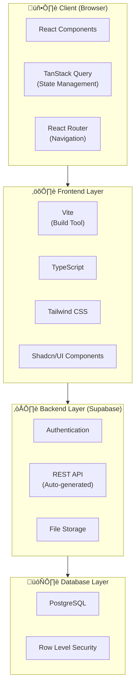
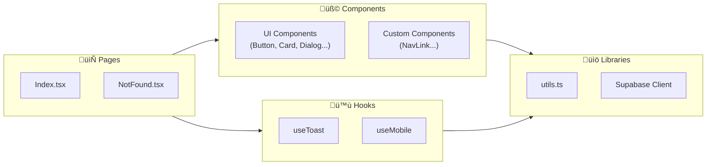
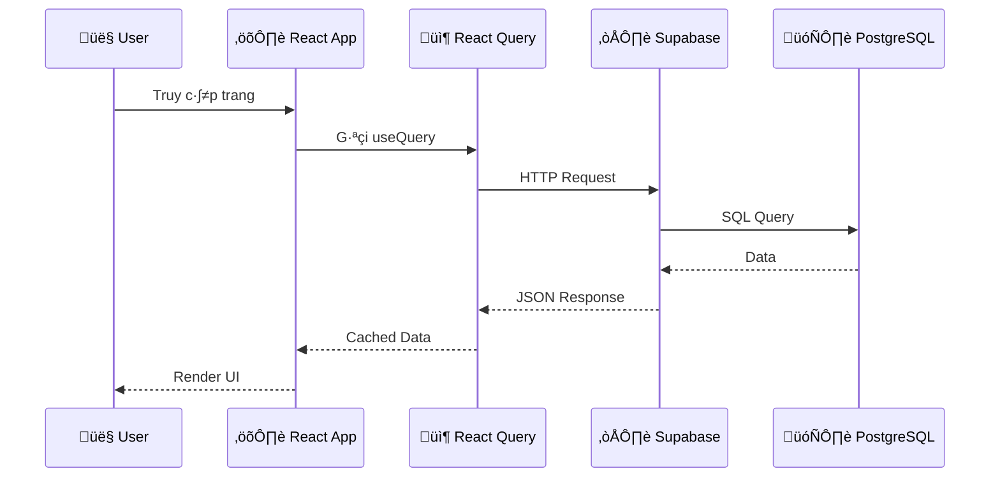
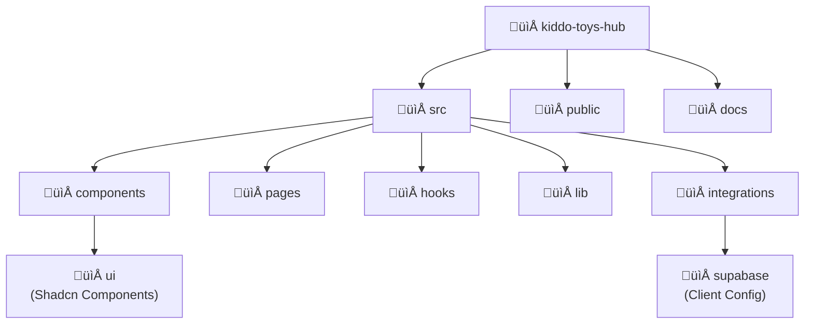
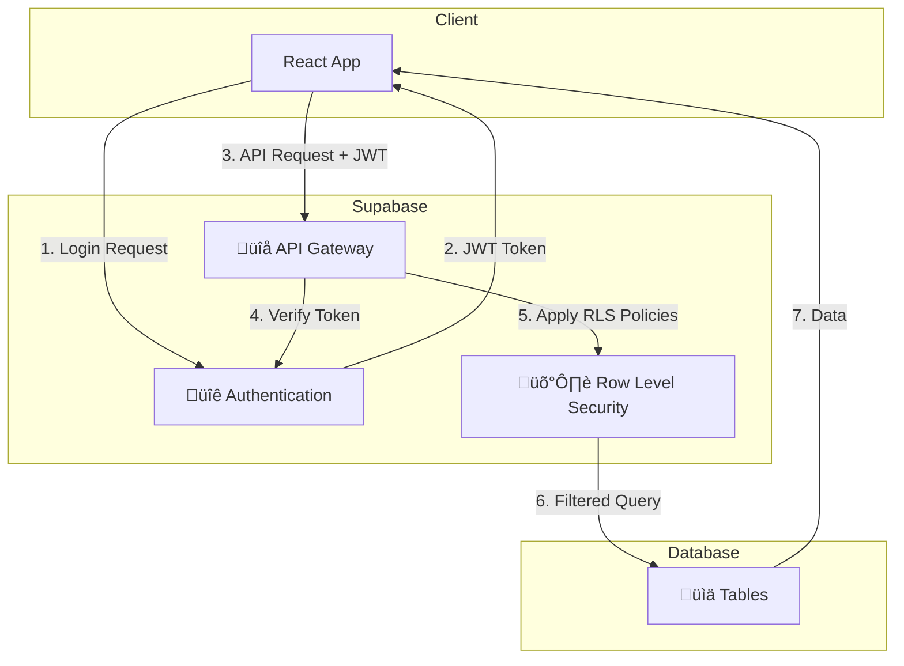
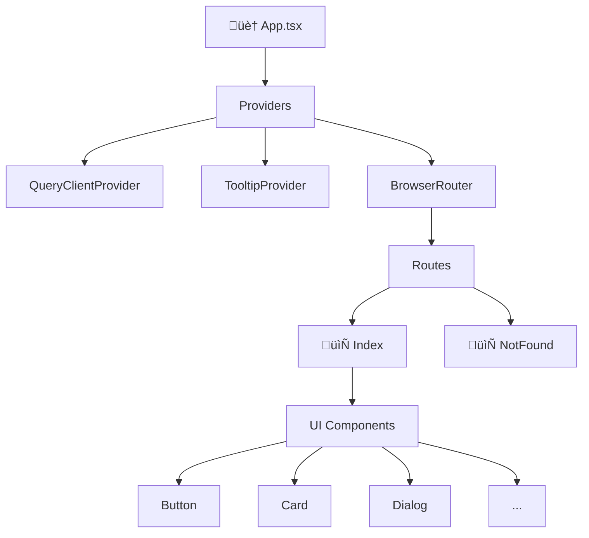
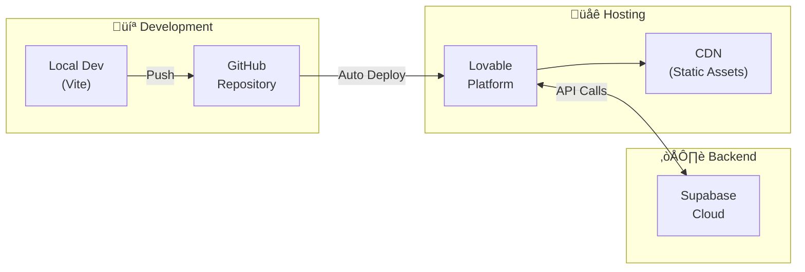
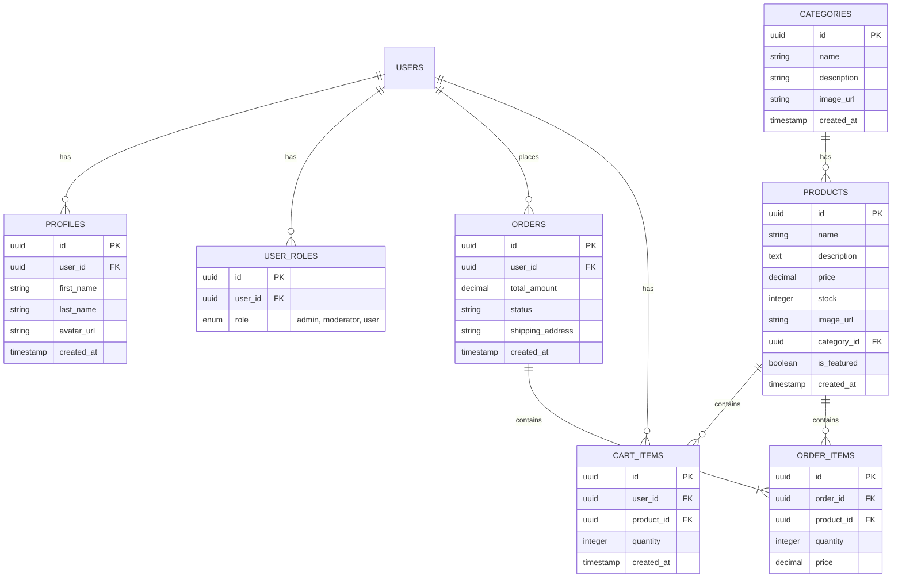

# 📘 Báo Cáo Kiến Trúc Hệ Thống - Kiddo Toys Hub

## 1. Tổng Quan Dự Án

**Kiddo Toys Hub** là một ứng dụng web thương mại điện tử chuyên bán đồ chơi trẻ em, được xây dựng với kiến trúc modern fullstack.

---

## 2. Kiến Trúc Tổng Quan Hệ Thống

```mermaid
flowchart TB
    subgraph Client["🖥️ Client (Browser)"]
        UI["React Components"]
        State["TanStack Query\n(State Management)"]
        Router["React Router\n(Navigation)"]
    end
    
    subgraph Frontend["⚛️ Frontend Layer"]
        Vite["Vite\n(Build Tool)"]
        TS["TypeScript"]
        Tailwind["Tailwind CSS"]
        Shadcn["Shadcn/UI Components"]
    end
    
    subgraph Backend["☁️ Backend Layer (Supabase)"]
        Auth["Authentication"]
        API["REST API\n(Auto-generated)"]
        Storage["File Storage"]
    end
    
    subgraph Database["🗄️ Database Layer"]
        PostgreSQL["PostgreSQL"]
        RLS["Row Level Security"]
    end
    
    Client --> Frontend
    Frontend --> Backend
    Backend --> Database
```

---

## 3. Ki·∫øn Tr√∫c Frontend Chi Ti·∫øt

```mermaid
flowchart LR
    subgraph Pages["📄 Pages"]
        Index["Index.tsx"]
        NotFound["NotFound.tsx"]
    end
    
    subgraph Components["üß© Components"]
        UI["UI Components\n(Button, Card, Dialog...)"]
        Custom["Custom Components\n(NavLink...)"]
    end
    
    subgraph Hooks["🪝 Hooks"]
        UseToast["useToast"]
        UseMobile["useMobile"]
    end
    
    subgraph Lib["üìö Libraries"]
        Utils["utils.ts"]
        Supabase["Supabase Client"]
    end
    
    Pages --> Components
    Pages --> Hooks
    Components --> Lib
    Hooks --> Lib
```

---

## 4. Luồng Dữ Liệu (Data Flow)

```mermaid
sequenceDiagram
    participant User as 👤 User
    participant React as ⚛️ React App
    participant Query as 📦 React Query
    participant Supabase as ☁️ Supabase
    participant DB as 🗄️ PostgreSQL
    
    User->>React: Truy c·∫≠p trang
    React->>Query: Gọi useQuery
    Query->>Supabase: HTTP Request
    Supabase->>DB: SQL Query
    DB-->>Supabase: Data
    Supabase-->>Query: JSON Response
    Query-->>React: Cached Data
    React-->>User: Render UI
```

---

## 5. Cấu Trúc Thư Mục

```mermaid
flowchart TD
    Root["📁 kiddo-toys-hub"]
    
    Root --> Src["📁 src"]
    Root --> Public["📁 public"]
    Root --> Docs["📁 docs"]
    
    Src --> Components["📁 components"]
    Src --> Pages["📁 pages"]
    Src --> Hooks["📁 hooks"]
    Src --> Lib["📁 lib"]
    Src --> Integrations["📁 integrations"]
    
    Components --> UIComponents["📁 ui\n(Shadcn Components)"]
    Integrations --> SupabaseInt["📁 supabase\n(Client Config)"]
```

---

## 6. Stack Công Nghệ

### 6.1. Frontend

| Công nghệ | Phiên bản | Mô tả |
|-----------|-----------|-------|
| React | 18.3.1 | Thư viện xây dựng UI |
| TypeScript | 5.8.3 | Ngôn ngữ lập trình có kiểu |
| Vite | 5.4.19 | Build tool & dev server |
| React Router DOM | 6.30.1 | Qu·∫£n l√Ω routing |
| TanStack React Query | 5.83.0 | Server state management |

### 6.2. UI/Styling

| Công nghệ | Phiên bản | Mô tả |
|-----------|-----------|-------|
| Tailwind CSS | 3.4.17 | Utility-first CSS framework |
| Shadcn/UI | - | Component library |
| Radix UI | Various | Headless UI primitives |
| Lucide React | 0.462.0 | Icon library |

### 6.3. Backend

| Công nghệ | Mô tả |
|-----------|-------|
| Supabase | Backend-as-a-Service |
| PostgreSQL | Relational database |
| Row Level Security | Bảo mật cấp hàng dữ liệu |

### 6.4. Thư viện Hỗ trợ

| Công nghệ | Phiên bản | Mô tả |
|-----------|-----------|-------|
| React Hook Form | 7.61.1 | Form management |
| Zod | 3.25.76 | Schema validation |
| date-fns | 3.6.0 | Date utilities |
| Sonner | 1.7.4 | Toast notifications |

---

## 7. Sơ Đồ Bảo Mật (Security Flow)

```mermaid
flowchart TB
    subgraph Client["Client"]
        App["React App"]
    end
    
    subgraph Supabase["Supabase"]
        Auth["üîê Authentication"]
        API["üîå API Gateway"]
        RLS["🛡️ Row Level Security"]
    end
    
    subgraph DB["Database"]
        Tables["üìä Tables"]
    end
    
    App -->|"1. Login Request"| Auth
    Auth -->|"2. JWT Token"| App
    App -->|"3. API Request + JWT"| API
    API -->|"4. Verify Token"| Auth
    API -->|"5. Apply RLS Policies"| RLS
    RLS -->|"6. Filtered Query"| Tables
    Tables -->|"7. Data"| App
```

---

## 8. Component Architecture

```mermaid
flowchart TB
    App["🏠 App.tsx"]
    
    App --> Providers["Providers"]
    Providers --> QueryProvider["QueryClientProvider"]
    Providers --> TooltipProvider["TooltipProvider"]
    Providers --> Router["BrowserRouter"]
    
    Router --> Routes["Routes"]
    Routes --> IndexPage["📄 Index"]
    Routes --> NotFoundPage["📄 NotFound"]
    
    IndexPage --> UIComponents["UI Components"]
    UIComponents --> Button["Button"]
    UIComponents --> Card["Card"]
    UIComponents --> Dialog["Dialog"]
    UIComponents --> More["..."]
```

---

## 9. Deployment Architecture

```mermaid
flowchart LR
    subgraph Development["💻 Development"]
        Local["Local Dev\n(Vite)"]
        GitHub["GitHub\nRepository"]
    end
    
    subgraph Hosting["üåê Hosting"]
        Lovable["Lovable\nPlatform"]
        CDN["CDN\n(Static Assets)"]
    end
    
    subgraph Backend["☁️ Backend"]
        SupabaseCloud["Supabase\nCloud"]
    end
    
    Local -->|"Push"| GitHub
    GitHub -->|"Auto Deploy"| Lovable
    Lovable --> CDN
    Lovable <-->|"API Calls"| SupabaseCloud
```

---

## 10. Sơ Đồ ERD (Entity Relationship Diagram)

```mermaid
erDiagram
    USERS ||--o{ PROFILES : has
    USERS ||--o{ USER_ROLES : has
    USERS ||--o{ ORDERS : places
    USERS ||--o{ CART_ITEMS : has
    
    PROFILES {
        uuid id PK
        uuid user_id FK
        string first_name
        string last_name
        string avatar_url
        timestamp created_at
    }
    
    USER_ROLES {
        uuid id PK
        uuid user_id FK
        enum role "admin, moderator, user"
    }
    
    PRODUCTS ||--o{ CART_ITEMS : contains
    PRODUCTS ||--o{ ORDER_ITEMS : contains
    CATEGORIES ||--o{ PRODUCTS : has
    
    CATEGORIES {
        uuid id PK
        string name
        string description
        string image_url
        timestamp created_at
    }
    
    PRODUCTS {
        uuid id PK
        string name
        text description
        decimal price
        integer stock
        string image_url
        uuid category_id FK
        boolean is_featured
        timestamp created_at
    }
    
    CART_ITEMS {
        uuid id PK
        uuid user_id FK
        uuid product_id FK
        integer quantity
        timestamp created_at
    }
    
    ORDERS ||--|{ ORDER_ITEMS : contains
    
    ORDERS {
        uuid id PK
        uuid user_id FK
        decimal total_amount
        string status
        string shipping_address
        timestamp created_at
    }
    
    ORDER_ITEMS {
        uuid id PK
        uuid order_id FK
        uuid product_id FK
        integer quantity
        decimal price
    }
```

### Mô tả các bảng:

| Bảng | Mô tả |
|------|-------|
| **users** | Bảng hệ thống của Supabase Auth, chứa thông tin đăng nhập |
| **profiles** | Thông tin chi tiết người dùng (tên, avatar) |
| **user_roles** | Phân quyền người dùng (admin, moderator, user) |
| **categories** | Danh mục sản phẩm đồ chơi |
| **products** | Sản phẩm đồ chơi (tên, giá, mô tả, hình ảnh) |
| **cart_items** | Giỏ hàng của người dùng |
| **orders** | Đơn hàng đã đặt |
| **order_items** | Chi tiết các sản phẩm trong đơn hàng |

### Các mối quan hệ:

- **1-N**: Một user có nhiều profiles, roles, orders, cart_items
- **1-N**: Một category có nhiều products
- **1-N**: Một order có nhiều order_items
- **N-1**: M·ªói product thu·ªôc m·ªôt category

---

## 11. K·∫øt Lu·∫≠n

Dự án **Kiddo Toys Hub** được xây dựng theo kiến trúc hiện đại với:

- **Frontend**: React + TypeScript + Vite cho hiệu suất cao
- **UI**: Tailwind CSS + Shadcn/UI cho giao diện đẹp, responsive
- **State Management**: TanStack Query cho quản lý dữ liệu server hiệu quả
- **Backend**: Supabase cung cấp giải pháp BaaS hoàn chỉnh
- **Database**: PostgreSQL với thiết kế ERD chuẩn hóa
- **Security**: Row Level Security đảm bảo bảo mật dữ liệu

---

*Tài liệu được tạo tự động bởi Lovable AI - Ngày: 23/12/2024*
